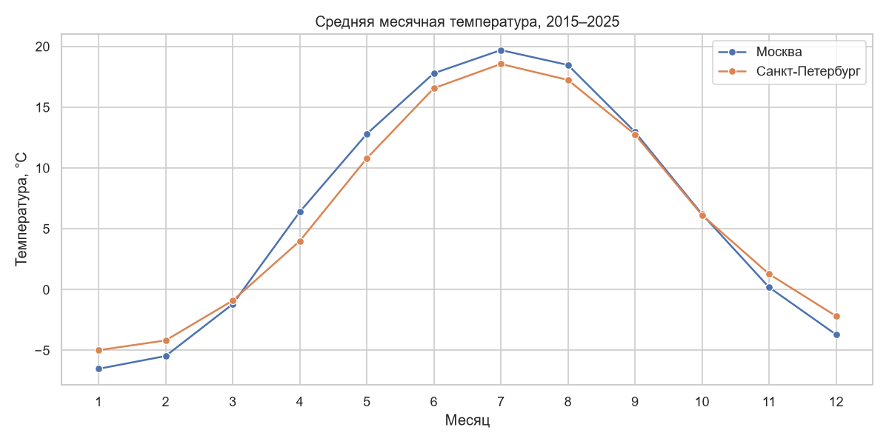

# Погода Москвы и Санкт-Петербурга, 2015–2025

Анализ 11 лет реальных ежедневных погодных данных двух столиц: температура,
осадки, тренд потепления и статистические проверки гипотез.



## Цель исследования

Изучить температурный режим и осадки Москвы и Санкт-Петербурга за 2015–2025
годы, оценить тренд изменения среднегодовой температуры и проверить
статистически две гипотезы.

## Задачи исследования

1. Загрузить реальные данные из открытого API Open-Meteo
2. Провести очистку и подготовку данных
3. Провести исследовательский анализ: температура, осадки, рекорды
4. Оценить тренд изменения температуры по годам
5. Сравнить Москву и Санкт-Петербург
6. Проверить гипотезы с помощью корреляции и t-теста

## Данные

| | |
|---|---|
| Источник | [Open-Meteo Archive API](https://open-meteo.com/en/docs/historical-weather-api) (ретроспективные данные ERA5) |
| Период | 2015-01-01 — 2025-12-31 (4018 дней на город) |
| Города | Москва (55.75, 37.62), Санкт-Петербург (59.93, 30.31) |
| Поля | средняя/максимальная/минимальная температура, осадки, снег |
| API-ключ | не требуется |
| Файлы | `data/moscow_daily.csv`, `data/spb_daily.csv` (~320 КБ) |

```


- Москва теплее Петербурга на ~2 °C весь год, сезонные профили совпадают по форме
- Максимум осадков — летом**, зимой осадков в 2–3 раза меньше
- Средняя температура выросла: Москва +0.42 °C, СПб +0.28 °C
  (2015–2019 против 2021–2025)
- **T-тест Уэлча не подтвердил значимость роста (p = 0.228):** за 11 лет
  данных недостаточно, чтобы отделить тренд от естественной изменчивости климата
- Корреляция температуры и осадков значима (p < 0.05), но практически слабая
  (r = 0.074): на большом массиве данных даже слабая связь даёт малый p-value


```
weather-analysis/
├── notebook.ipynb      
├── README.md
├── requirements.txt
├── data/               
└── assets/            
```
